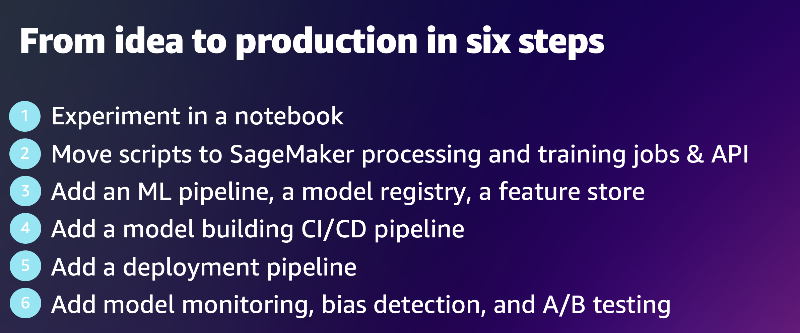

# Amazon SageMaker MLOps: from idea to production in six steps
This repository contains a sequence of simple notebooks demonstrating how to move from an ML idea to production by using [Amazon SageMaker](https://aws.amazon.com/sagemaker).

The notebooks make use of SageMaker [processing](https://docs.aws.amazon.com/sagemaker/latest/dg/processing-job.html) and [training](https://docs.aws.amazon.com/sagemaker/latest/dg/train-model.html) jobs, and SageMaker MLOps features such as [SageMaker Pipelines](https://aws.amazon.com/sagemaker/pipelines/), [SageMaker Feature Store](https://aws.amazon.com/sagemaker/feature-store/), [SageMaker Model Registry](https://docs.aws.amazon.com/sagemaker/latest/dg/model-registry.html), and [SageMaker Model Monitor](https://aws.amazon.com/sagemaker/model-monitor/).

You start with a simple notebook with basic ML code for data preprocessing, feature engineering, and model training. Each subsequent notebook builds on top of the previous and introduce one or several SageMaker features:


Each notebook also provides links to useful SageMaker hands-on resources and proposes some ideas for additional development.

You follow along the six notebooks and develop your ML idea from an experimental notebook to a production-ready solution following the recommended MLOps practices:



## Getting started

### Prerequisites
You need an **AWS account**. If you don't already have an account, follow the [Setting Up Your AWS Environment](https://aws.amazon.com/getting-started/guides/setup-environment/) getting started guide for a quick overview.

### AWS Instructor-led workshop
If you participating in an AWS Immersion Day and would like to use a provided AWS account, please follow this [instructions](https://catalog.us-east-1.prod.workshops.aws/workshops/63069e26-921c-4ce1-9cc7-dd882ff62575/en-US/prerequisites/option1) how to claim your AWS account via Event Engine and how to start SageMaker Studio. 
❗ Skip the steps **Set up Amazon SageMaker Studio domain** and **Deploy CloudFormation template** if you use Event Engine and AWS-provisioned account.

### Set up Amazon SageMaker Studio domain
To run the notebooks you can use [SageMaker Studio](https://aws.amazon.com/sagemaker/studio/) which requires a [SageMaker Studio domain](https://docs.aws.amazon.com/sagemaker/latest/dg/studio-entity-status.html).

An AWS account can have only one SageMaker Studio domain per Region. If you already have a SageMaker Studio domain in the US East (N. Virginia) Region, follow the [SageMaker Studio setup guide](https://aws.amazon.com/getting-started/hands-on/machine-learning-tutorial-set-up-sagemaker-studio-account-permissions/) to attach the required AWS IAM policies to your SageMaker Studio account. Skip the next step.

#### Deploy CloudFormation template
If you don't have an existing SageMaker Studio domain, you must deploy an AWS CloudFormation template that creates a SageMaker Studio domain and adds the permissions required for running the provided notebooks.

Choose this [AWS CloudFormation stack](https://us-east-1.console.aws.amazon.com/cloudformation/home?region=us-east-1#/stacks/quickcreate?templateURL=https://sagemaker-sample-files.s3.amazonaws.com/libraries/sagemaker-user-journey-tutorials/CFN-SM-IM-Lambda-catalog.yaml&stackName=CFN-SM-IM-Lambda-Catalog) link. The link opens the AWS CloudFormation console in your AWS account and creates your SageMaker Studio domain and a user profile named `studio-user`. It also adds the required permissions to your SageMaker Studio domain. In the CloudFormation console, confirm that **US East (N. Virginia)** is the Region displayed in the upper right corner. Stack name should be `CFN-SM-IM-Lambda-catalog`, and should not be changed. This stack takes about 10 minutes to create all the resources.

❗ This stack assumes that you already have a public VPC set up in your account. If you do not have a public VPC, see [VPC with a single public subnet](https://docs.aws.amazon.com/vpc/latest/userguide/VPC_Scenario1.html) to learn how to create a public VPC. 

Select **I acknowledge that AWS CloudFormation might create IAM resources**, and then choose **Create stack**.


On the **CloudFormation** pane, choose **Stacks**. It takes about 10 minutes for the stack to be created. When the stack is created, the status of the stack changes from `CREATE_IN_PROGRESS` to `CREATE_COMPLETE`. 


### Start SageMaker Studio
If you deployed the CloudFormation template, follow [Log In from the Amazon SageMaker console](https://docs.aws.amazon.com/sagemaker/latest/dg/notebooks-get-started.html) instructions to open Studio.
Use `studio-user` user profile to launch Studio:


### Download notebooks into your Studio environment
To use the provided notebooks you must clone the source code repository into your Studio environment.
Open a system terminal in Studio in the **Launcher** window:


Run the following command in the terminal:
```sh
git clone https://github.com/aws-samples/amazon-sagemaker-from-idea-to-production.git
```

The code repository will be downloaded and saved in your home directory in Studio.

### Start exploring
Go to the Studio file browser inside the folder `amazon-sagemaker-from-idea-to-production`. Open `00-start-here.ipynb` notebook and follow the instructions.

## Clean-up
To avoid charges, you must remove all project-provisioned and generated resources from your AWS account. 
Run all steps in the provided [clean-up notebook](99-clean-up.ipynb).
If you provisioned a Studio domain for this workshop, and don't need the domain, you can delete the domain by following [this instructions](https://docs.aws.amazon.com/sagemaker/latest/dg/gs-studio-delete-domain.html).

## Dataset
This example uses the [direct marketing dataset](https://archive.ics.uci.edu/ml/datasets/bank+marketing) from UCI's ML Repository:
> [Moro et al., 2014] S. Moro, P. Cortez and P. Rita. A Data-Driven Approach to Predict the Success of Bank Telemarketing. Decision Support Systems, Elsevier, 62:22-31, June 2014

## Resources
The following list presents some useful hands-on resources to help you to get started with ML development on Amazon SageMaker.

- [Get started with Amazon SageMaker](https://aws.amazon.com/sagemaker/getting-started/)
- [Amazon SageMaker 101 workshop](https://catalog.us-east-1.prod.workshops.aws/workshops/0c6b8a23-b837-4e0f-b2e2-4a3ffd7d645b/en-US)
- [Amazon SageMaker 101 workshop code repository](https://github.com/aws-samples/sagemaker-101-workshop)
- [Amazon SageMaker Immersion Day](https://catalog.us-east-1.prod.workshops.aws/workshops/63069e26-921c-4ce1-9cc7-dd882ff62575/en-US)
- [Amazon SageMaker End to End Workshop](https://github.com/aws-samples/sagemaker-end-to-end-workshop)
- [End to end Machine Learning with Amazon SageMaker](https://github.com/aws-samples/amazon-sagemaker-build-train-deploy)
- [A curated list of awesome references for Amazon SageMaker](https://github.com/aws-samples/awesome-sagemaker)

Copyright Amazon.com, Inc. or its affiliates. All Rights Reserved.
SPDX-License-Identifier: MIT-0
